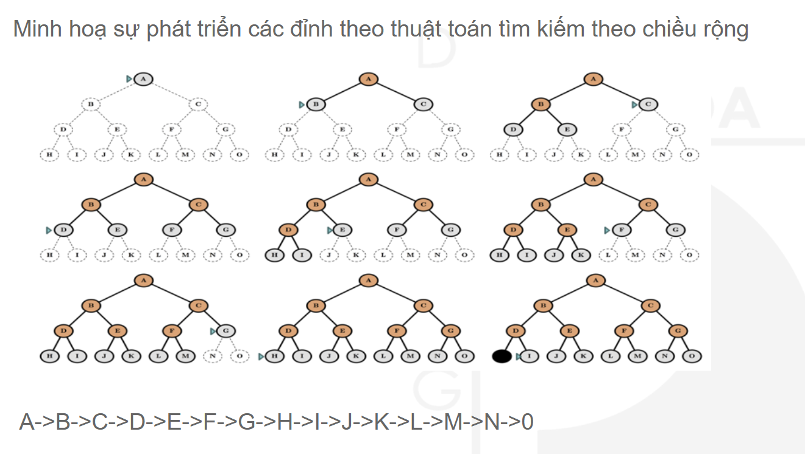
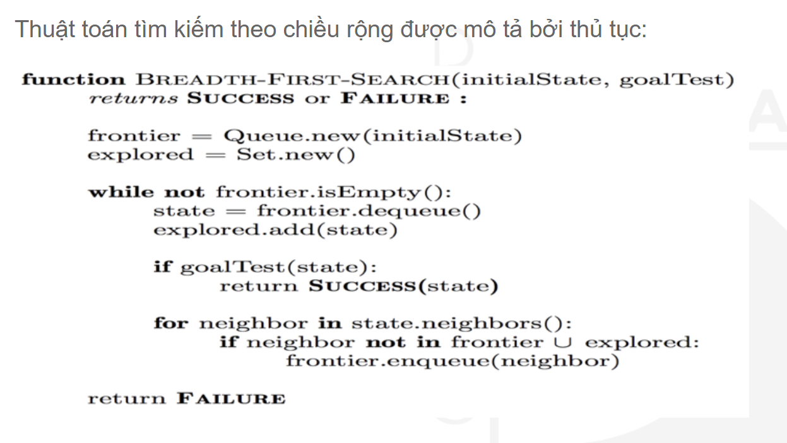

### Không gian trạng thái

- Đồ thị không gian trạng thái là một bộ ký hiệu [V, E, S, G] trong đó:
  - V - tập đỉnh/tập tất cả các trạng thái;
  - E - tập cạnh/ tập cung/ tập toán tử;
  - S - trạng thái đầu;
  - G - trạng thái đích.
- Lời giải (solution path) là một con đường đi từ trạng thái S đến trạng thái G.

## Chiến lược tìm kiếm mù

### Tìm kiếm theo chiều rộng (BFS)

- Từng tầng từ trên xuóng
- Phát triển trạng thái gần với trạng thái hiện tại
- Tập trạng thái được chia làm 3 khu vực :

  - Khu vực đã phát triển(explored): tập trạng thái đã xét
  - Khu vực chờ phát triển(frontier): tập trạng thái đang chờ xét
  - Khu vực chưa phát triển(unexplored): tập trạng thái chưa xét

